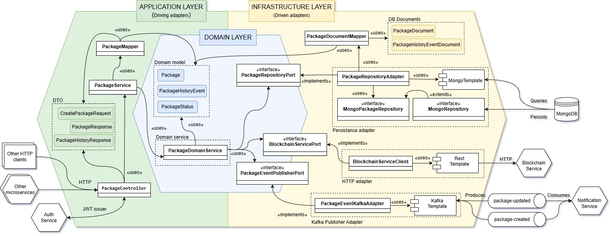

# Package Tracking Service


Este microservicio forma parte del sistema `ParcelTrust`, desarrollado como Trabajo de Fin de Grado. Su función principal es gestionar el ciclo de vida de paquetes postales, proporcionando trazabilidad transparente, verificable y segura a través de una arquitectura distribuida basada en microservicios, eventos Kafka y registro inmutable en blockchain (Ethereum Sepolia).



---

## Tecnologías utilizadas

* **Java 17** + **Spring Boot 3**
* **MongoDB** para persistencia NoSQL
* **Apache Kafka** como bus de eventos asíncrono
* **OpenAPI (springdoc-openapi)** para documentación REST
* **Docker + Docker Compose** para despliegue local
* **JWT / OAuth2** para autenticación y autorización
* **Arquitectura Hexagonal (puertos y adaptadores)**

---

## Responsabilidad

El **Package Tracking Service** se encarga de:

* Crear nuevos paquetes (evento `package-created`)
* Actualizar su estado (evento `package-updated`)
* Consultar estado y localización actual
* Consultar historial desde blockchain
* Buscar paquetes según filtros

---

## Arquitectura

Este microservicio sigue una **arquitectura hexagonal**, basada en puertos y adaptadores organizada en 3 capas:

* **Application Layer**: controladores REST, mappers, servicios de aplicación y DTOs
* **Domain Layer**: entidades, servicios de dominio, puertos
* **Infrastructure Layer**: adaptadores de persistencia (Mongo), eventos Kafka, cliente blockchain (HTTP)

---

## Estructura del proyecto

```
package-tracking-service
├── .github/workflows              # Workflows de CI/CD con GitHub Actions
├── .mvn/wrapper                   # Maven wrapper
├── src
│   ├── main
│   │   ├── java/com/tfg/packagetracking
│   │   │   ├── application
│   │   │   │   ├── config         # Beans y configuración (DomainService, etc.)
│   │   │   │   ├── controllers    # Controladores REST (PackageController)
│   │   │   │   ├── dto            # Clases DTO de entrada/salida
│   │   │   │   ├── exceptions     # Manejador global de excepciones (REST)
│   │   │   │   ├── mappers        # Mappers entre entidades y DTOs
│   │   │   │   ├── services       # Servicios de aplicación (PackageService)
│   │   │   │   └── utils          # Utilidades comunes (ControllerUtils)
│   │   │   ├── config             # Configuración general (RestTemplate)
│   │   │   ├── domain
│   │   │   │   ├── exceptions     # Excepciones de dominio (PackageNotFound...)
│   │   │   │   ├── models         # Entidades de dominio (Package, Status...)
│   │   │   │   ├── ports          # Interfaces de persistencia, eventos, blockchain
│   │   │   │   ├── services       # Lógica de negocio (PackageDomainService)
│   │   │   │   └── utils          # Utilidades internas del dominio (TimeUtils)
│   │   │   └── infrastructure
│   │   │       ├── adapters       # Adaptadores: MongoRepo, KafkaPublisher, REST client
│   │   │       ├── config         # Configuración de seguridad, OpenAPI, datos
│   │   │       ├── documents      # Documentos MongoDB (PackageDocument...)
│   │   │       ├── mappers        # Mappers entre documentos de Mongo y modelos de dominio
│   │   │       └── repositories   # Repositorios concretos (MongoPackageRepository)
│   │   └── resources              # application.properties y JSONs de datos
│   └── test/java/com/tfg/packagetracking
│       ├── application
│       │   ├── controllers        # Tests de PackageController
│       │   └── services           # Tests de PackageService
│       ├── domain
│       │   ├── models             # Tests de modelos (Package, etc.)
│       │   └── services           # Tests del dominio (PackageDomainService)
│       └── infrastructure
│           ├── adapters           # Tests de integración de Kafka y Mongo
│           └── config             # Tests de DataSeeder
├── docker-compose.yml             # Infraestructura para desarrollo local
├── Dockerfile                     # Imagen Docker del microservicio
├── mvnw / mvnw.cmd                # Wrapper de Maven
├── pom.xml                        # Definición de dependencias y plugins
└── README.md                      # Este archivo
```

---

## Endpoints REST disponibles

| Método | Ruta                     | Descripción                               |
| ------ | ------------------------ | ----------------------------------------- |
| POST   | `/packages`              | Crear un nuevo paquete                    |
| PATCH  | `/packages/{id}/status`  | Actualizar estado y localización          |
| GET    | `/packages/{id}`         | Consultar estado actual                   |
| GET    | `/packages/{id}/history` | Obtener historial desde blockchain        |
| GET    | `/packages/search`       | Buscar por filtros (estado, origen, etc.) |

> Todos los endpoints están documentados en Swagger UI: [http://localhost:8080/swagger-ui](http://localhost:8080/swagger-ui/index.html)

---

## Seguridad de endpoints

Todos los endpoints están protegidos mediante **OAuth2 + JWT**:

* El token se valida automáticamente por Spring Security.
* Se extraen los **capabilities** del usuario desde el token.
* La anotación `@PreAuthorize` asegura que solo el usuario con permisos suficientes puede llamar al método.

Ejemplo:
```java
@PreAuthorize("hasAuthority('FIND_PACKAGE') and @controllerUtils.isOwner(#id)")
```

---

## Estructura del JWT

Los tokens JWT contienen los siguientes claims:

```json
{
  "sub": "user@example.com",
  "roles": ["USER"],
  "capabilities": ["CREATE_PACKAGE", "FIND_PACKAGE", "VIEW_HISTORY"],
  "scope": "openid",
  "exp": 1750123456,
  "iss": "http://auth-service.localtest.me:9000"
}
```

Estos claims permiten aplicar reglas finas de seguridad usando `@PreAuthorize`.


---

## Flujos funcionales

### Creación de un paquete

1. El cliente envía una petición `POST /packages`
2. El servicio valida la entrada y almacena el paquete en MongoDB
3. Publica un evento `package-created` en Kafka
4. El `notification-service` escucha y registra en blockchain

### Actualización de estado

1. `PATCH /packages/{id}/status` actualiza el estado y ubicación
2. Se actualiza el documento en MongoDB
3. Se emite un evento `package-updated` en Kafka
4. Se registra la nueva entrada en blockchain

---

## Esquema de datos

### Crear paquete

POST /packages
```json
{
  "id": "PKG-12345",
  "origin": "Barcelona",
  "destination": "Madrid"
}
```

### Respuesta esperada

```json
{
  "id": "PKG-12345",
  "status": "CREATED",
  "location": "Barcelona",
  "timestamp": "2025-06-01T08:00:00Z"
}
```

---

## Persistencia

* Los paquetes y su historial se almacenan en **MongoDB**
* Se usa `MongoRepository` y `MongoTemplate` para queries dinámicas

---

## Mensajería Kafka

* Eventos publicados:
    * `package-created`
    * `package-updated`
* Consumidor: `notification-service`, que registra el evento en blockchain

---

## Blockchain

* Los eventos se registran en Ethereum Sepolia mediante `blockchain-service`
* El historial se consulta desde el contrato inteligente mediante HTTP

---

## Pruebas

* **Unitarias**: servicios, controladores, dominio (mockito, JUnit 5)
* **Arquitectura**: validación de dependencias hexagonales y cumplimiento arquitectónico (ArchUnit)
* **Integración**: Kafka + MongoDB + HTTP (Testcontainers)

Ejecutar tests unitarios y de arquitectura:
```
mvn test
```
Ejecutar tests de integración:
```
mvn verify -Pintegration-tests
```

---

## Compilación manual

```bash
./mvnw clean package -DskipTests
java -jar target/package-tracking-service-0.0.1-SNAPSHOT.jar
```

---

## Despliegue local con Docker

### Requisitos previos

* Java 17
* Docker y Docker Compose
* Maven 3.9+

### Levantar el entorno

```bash
docker-compose up
```

Esto iniciará:

* MongoDB
* Kafka + Zookeeper
* Este microservicio (port 8080)

### Variables de entorno

Configurable en `application-local.properties` y `application-docker.properties`:

* `spring.data.mongodb.uri`
* `spring.kafka.bootstrap-servers`
* `blockchain.service.url`

---

## CI/CD y despliegue

Este microservicio se integra con **GitHub Actions** para automatizar el ciclo de vida de desarrollo:

* `build.yml`: compila y verifica que el proyecto se construye correctamente.
* `unit-tests.yml`: ejecuta los tests unitarios con cobertura.
* `integration-tests.yml`: arranca MongoDB y Kafka usando Testcontainers y lanza pruebas de integración.
* `docker-publish.yml`: construye y publica la imagen Docker al registry.
* `pipeline.yml`: orquesta los workflows anteriores como pipeline completa.

### Despliegue local

Utiliza `docker-compose.yml` para levantar el servicio junto a sus dependencias:

* MongoDB
* Kafka + Zookeeper

El servicio expone el puerto `8080` y se comunica con otros microservicios usando HTTP REST y Kafka.

---

## Convenciones de código

* Estructura hexagonal: `application`, `domain`, `infrastructure`
* DTOs para separación clara entre capa REST y dominio
* `mappers` explícitos para cada transformación
* `@Service`, `@RestController` y `@Repository` bien delimitados
* Testing dividido en `unit`, `integration` y `architecture`

---

## Limitaciones y decisiones de diseño

* Blockchain se utiliza como **fuente de verdad inmutable** solo para el historial, no para búsquedas dinámicas
* Se opta por arquitectura hexagonal para mejorar mantenibilidad y testeo
* Los eventos Kafka permiten desacoplar microservicios y mejorar escalabilidad

---

Proyecto desarrollado como parte del TFG de **Alex Moll Rodríguez** para la **UOC (Universitat Oberta de Catalunya)** - 2025
